# Introduction

Autonomous vehicles are one of the emerging technologies with great potential to transform the world, whether in urban and road transportation of people and goods, or in field applications such as agriculture and mining. Among the various positive impacts, autonomous vehicles have the ability to increase efficiency, effectiveness, and safety in transportation and field applications.

Tasks of environment perception, such as detecting people, animals, vehicles, and navigable routes, contribute to the supervision and understanding of the environment and objects around the vehicle and enable the accomplishment of autonomous navigation tasks. While cameras provide rich visual information, LIDARs and RADARs provide measurements of distances between objects and the vehicle.

One of the remaining challenges for reliable and safe environment perception is related to adverse and critical conditions, such as rain, fog, and dust. Such conditions can reduce the visibility distance of sensors or cause errors in environment perception. In the particular case of cameras, algorithms can be used to treat images affected by adverse weather conditions, removing unwanted visual effects from the image. For example, deep learning methods can be used to remove noise and artifacts in the image caused by raindrops accumulated on the camera lens or vehicle windshield.

In this context, the main objectives of the project were to understand the impacts of hostile environmental conditions of operation - focusing on rain and fog - on environment perception through cameras and the study and implementation of algorithms for the treatment of images affected by such conditions.

 
 
 
## Neural Network for Restoration of Images Corrupted by Adverse Environmental Conditions

In adverse environmental conditions, images captured by the camera may suffer distortions due to different optical phenomena. Considering environment perception on rainy days, raindrops can adhere to the camera lens or vehicle windshield, behaving like secondary lenses and forming an optical system that can distort the captured images. The presence of fog in the atmosphere, in turn, forms a scattering medium that disperses light coming from or reflected by objects in the scene, which can result in reduced contrast and sharpness of the captured image and even in the complete obstruction of objects or the environment. Recently, deep learning-based approaches have been employed for restoring images captured in rainy or foggy environments.

The chosen method to address both tasks in this project is a generative adversarial network where the generator network consists of 4 down-convolution layers, 9 residual blocks, and 4 up-convolution layers, as shown in Figure 1.

<figure>
    <figcaption> <b>Figure 1:</b> Architecture of the chosen method's generator network</figcaption>
    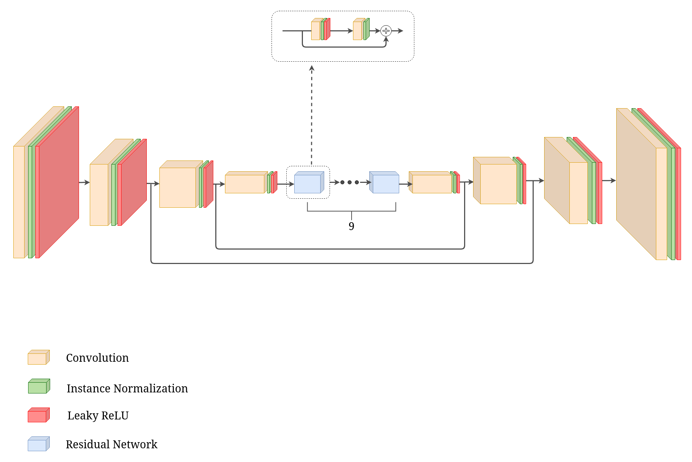
</figure>

 
 

## Results

### Raindrop Removal

The qualitative results for raindrop removal are depicted in Figure 2. The model effectively removes raindrops while preserving image structure and luminosity similar to the ground truth.

<figure id="fig:res-dr-1">
    <figcaption> <b>Figure 2:</b> Qualitative results for the raindrop removal task. The first column shows the ground truth image. The second column shows the input image containing raindrops. The third column shows the image generated by the network. The last column represents the difference between the generated and expected images.</figcaption>
    

        

            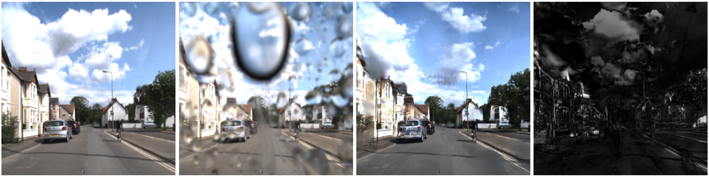
        

        

            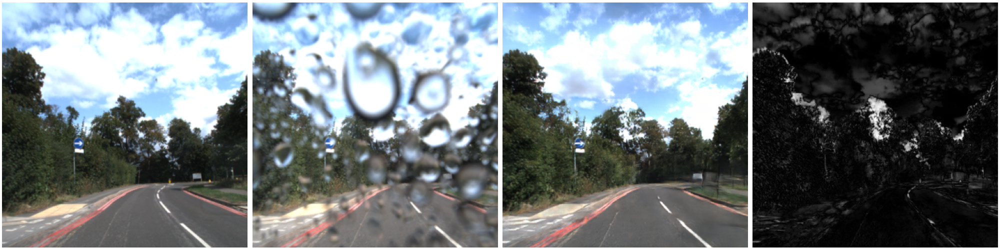
        

        

            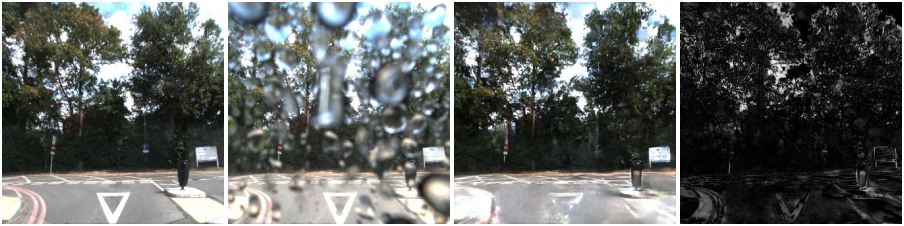
        

        

            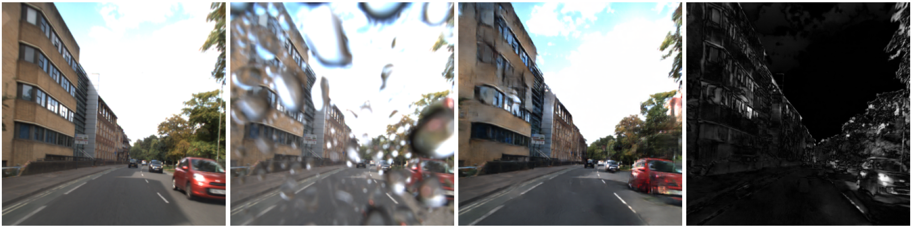
        

        

            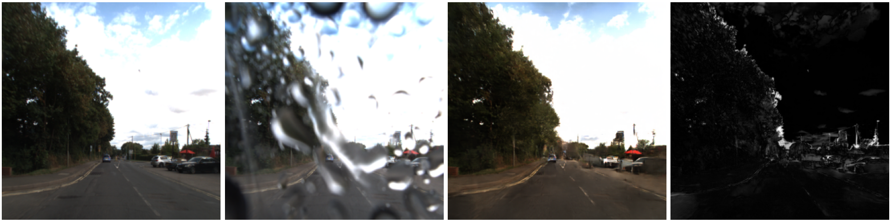
        

    

</figure>

 
 

Quantitatively, an analysis of SSIM and PSNR metrics reveals a notable enhancement in image quality compared to raw images, as shown in Table 1.

**Table 1: Quantitative Results for Raindrop Removal**
| Image    | Metric | Value  |
|----------|--------|--------|
| Raw      | PSNR   | 12.8046|
|          | SSIM   | 0.4662 |
| Generated| PSNR   | 20.2564|
|          | SSIM   | 0.7364 |

### Fog Removal

For fog removal, qualitative results vary based on fog density and homogeneity, as seen in Figure 3. While the model excels with less dense and homogenous fog, performance degrades with denser and non-homogeneous fog. 

<figure>
    <figcaption> <b>Figure 3:</b> Qualitative results for the fog removal task. The first column shows the ground truth image. The second column shows the input image containing fog. The third column shows the image generated by the network. The last column represents the difference between the generated and expected images.</figcaption>
    

        

            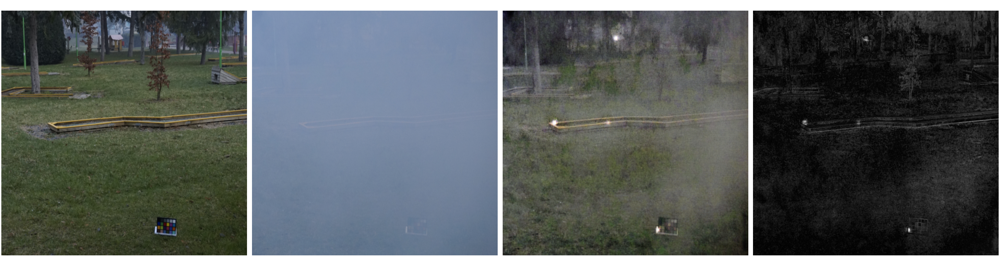
        

        

            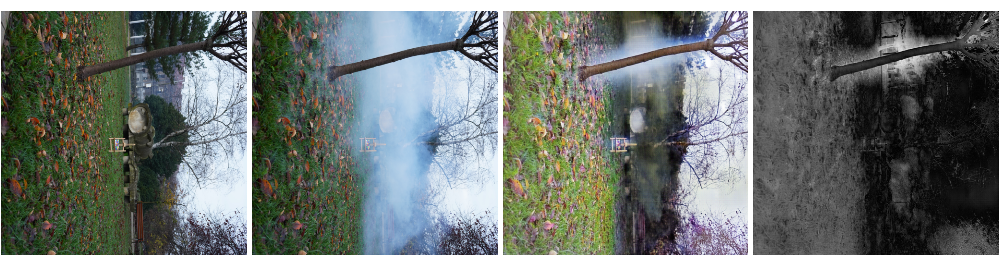
        

        

            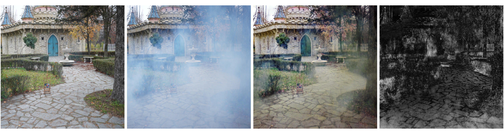
        

        

            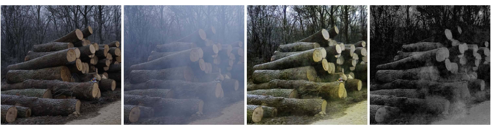
        

        

            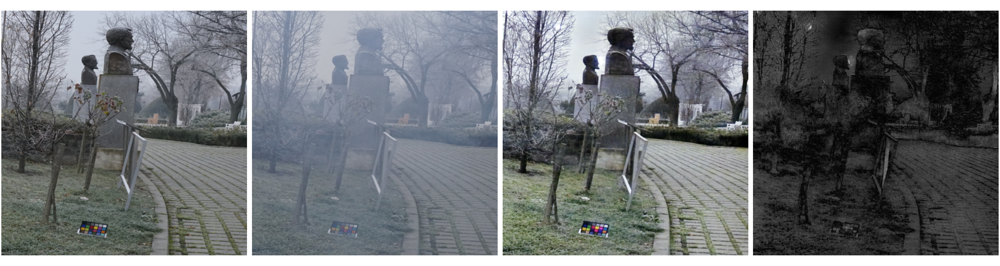
        

    

</figure>

 
 

Quantitative analysis, shown in Table 2, highlights improved PSNR and SSIM for generated images compared to raw ones, albeit with a smaller improvement compared to raindrop removal. Challenges in fog removal stem from the model's original focus on raindrop removal and insufficient training data for fog removal.

**Table 2: Quantitative Results for Fog Removal**
| Image    | Metric | Value  |
|----------|--------|--------|
| Raw      | PSNR   | 11.0827|
|          | SSIM   | 0.4200 |
| Generated| PSNR   | 16.5725|
|          | SSIM   | 0.6597 |

